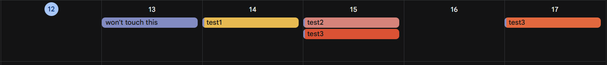
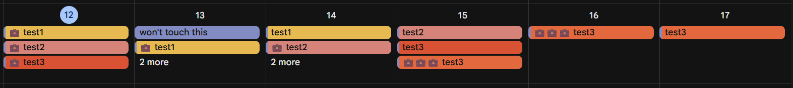

# Weighted Calendar

## Purpose

- This App adds and removes work events to your calendar for upcoming due dates within 30 days.  
- A 'Work Event' is a Google Calendar event that starts with '💼'.  
- Each work event has 1 or more '💼's in the event's name.  
- The number of '💼's in the name determine the hours to work:  
  - ex. '💼💼💼 test1' means, study 3 hours on that day for 'test1'

## Tips

> WARNING: Any event starting with '💼' will be interpreted as a work event and will be deleted during the algorithm

> TIP: you can enter 0 for the 'available time' to just remove events 

## Colour

The colour of events determines its importance:  
- banana -> low importance
- flamingo -> medium importance
- tangerine -> high importance
- tomato -> very high importance
- other -> skipped

## Images

Before:

After:

## Algorithm

The algorithm determines the priority to add work events to the calendar

colourValue = if x is 1 or 2 or 3 or 4 -> 100 * x / (1+2+3+4)  
timeValue = 100 - (100 * hours / (hoursPerDay * days))  
availableTime = availableTimeInDay * hours / hoursPerDay  
penalty = penaltyMultiplier * workEventsPlaced / availableTime  
Priority = (colourWeight * colourValue) + (timeWeight * timeValue) - penalty  
